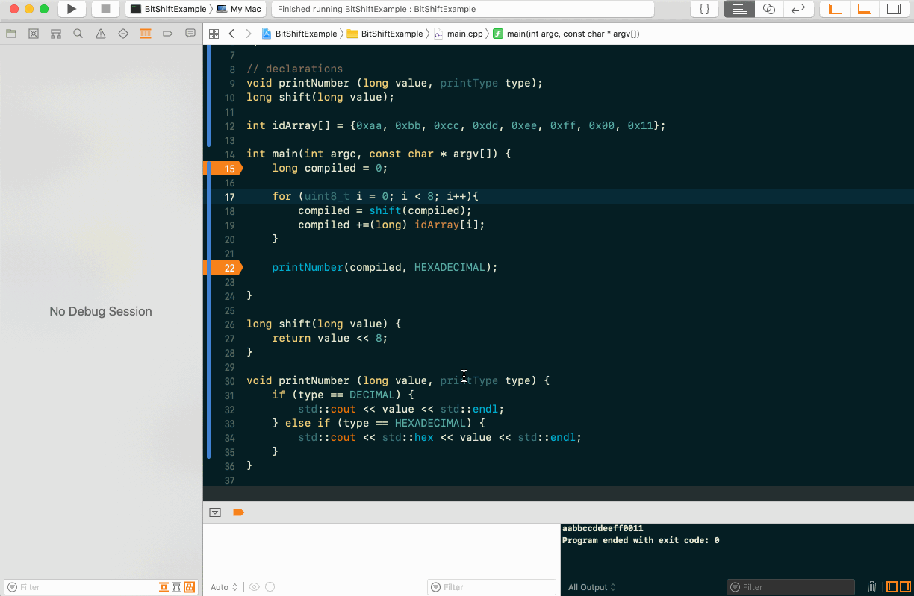

#  Learning bit shifting

I have a project I'm working on where I need to compare a an array of hex values that make up an ID. I figured one way I could do this would be to use bit shifting to compiled all fo the values into one large value for easier storage and comparison. I don't know if this is the _best_ way per se, but it did seem like a good opportunity to step back and try to really grok bit shifting and itss ancillary concepts (I'm green to cpp so a lot of those concepts are still somewhat foreign). 

This is a simple demo that takes an array of int hex values and shifts them onto a single long value. 

After doing all of this and thinking about the size of the ids that I'm going to need to store and compare I think it may be a better idea to make a struct to store the arrays and a simple method for comparing two of the structs, but it was good to stop and learn the fundamentals! 
